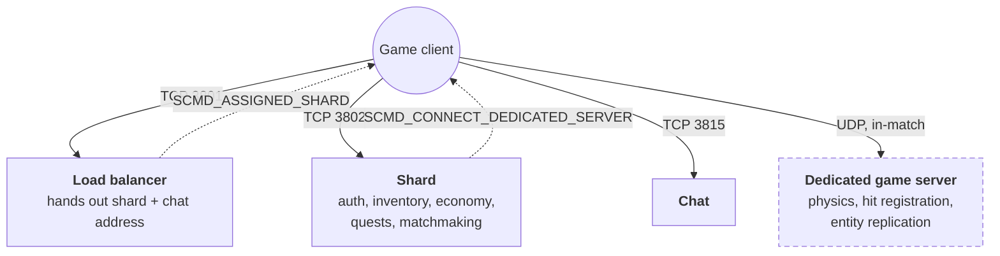

# Star Konflict

Record everything **Star Conflict**'s servers say, before they are switched off — so the game can
be understood, and eventually reimplemented, afterwards.

This repository contains one tool, `sccap`, plus the reference material it needs. It is **Go
only**: no interpreter, no scripts, no second language anywhere. It runs on **Windows**, where the
game runs — one binary, plus one extra install ([Npcap](https://npcap.com)) if you want to record
rather than just read recordings.

> **If you read nothing else:** capturing is the only part of this project with a deadline.
> Every session you play without recording is gone permanently. The tool works today — jump to
> [Part 2](#part-2--setup-once-per-machine).

---

## Contents

- [Part 1 — What we're doing, in plain terms](#part-1--what-were-doing-in-plain-terms)
- [Part 2 — Setup (once per machine)](#part-2--setup-once-per-machine)
- [Part 3 — Before every session](#part-3--before-every-session)
- [Part 4 — Recording a session](#part-4--recording-a-session)
- [Part 5 — After every session](#part-5--after-every-session)
- [Part 6 — The capture checklist](#part-6--the-capture-checklist)
- [Part 7 — Progress tracking](#part-7--progress-tracking)
- [Reference](#reference)

---

## Part 1 — What we're doing, in plain terms

### The clock we don't control

| Activity | Possible after shutdown? |
|---|---|
| **Capturing** what the servers actually said | ❌ Never again |
| **Decoding** what those messages mean | ✅ Forever, from a recording |
| **Reimplementing** a server that says the same things | ✅ Forever, from a recording |

Only the first line expires. Everything else can be done later — but only from data somebody
archived first. That single fact explains every design decision below.

### How the recording works: a tape recorder, not a switchboard

The obvious approach is to sit a program *between* the game and the server, relaying messages and
writing down what goes past — a switchboard operator taking notes. It works, but the operator is
in the middle of the call. If they get confused or crash, the call itself is affected, and their
notes are only as good as their understanding at the time.

We do the other thing. The game talks directly to the real servers exactly as normal, and we clip
a **tape recorder** onto the wire: every packet crossing your network card is copied into a
standard `.pcapng` file. We take no part in the conversation.

```
   game client ─────────────────────────────► game servers
                       │
                       │ (copy)
                       ▼
                 raw recording ──► naming / indexing / coverage
                   (evidence)         (derived, can be rebuilt)
```

This matters for one reason: **nothing has to be understood in order to be kept.** Unknown
message types, malformed data, traffic nobody predicted — it all lands in the recording
identically, because no code anywhere asks "is this worth keeping?" That question can only be
answered wrong, and once the servers are gone it can never be answered again.

Working out what the messages *mean* is a separate program that reads the file afterwards. If it
crashes, misreads, or gets improved five years from now, the recording is untouched.

### Two different meanings of "complete"

This is the part worth understanding properly, because only one half is your problem.

**Complete recording of what happened** — engineered and provable. Four independent checks:

1. **The game numbers its own messages.** A gap in the sequence is visible.
2. **The network numbers its own bytes**, separately. A second, unrelated gap detector.
3. **Every message carries a checksum.** Damage is detectable, not just absence.
4. **The operating system counts what it threw away**, and that number is on your screen during
   capture. It must stay at zero.

You don't have to do anything for these. They're tested, including against a completely separate
capture tool.

**Complete coverage of what *can* happen** — this is a scavenger hunt, and it's your job. If
nobody ever joins a clan while recording, the clan messages never cross the wire, and no amount of
perfect recording produces them. That's what [the checklist](#part-6--the-capture-checklist) is
for.

### Named, seen, understood

We know the names of **404** things the protocol can say — 39 message types, 249 request codes,
116 notification types — because they were sitting in the game's own program file. Each is in one
of three states:

```
  NAMED       we know it exists                        404 of them
  SEEN        it has actually appeared in a recording   ← only this has a deadline
  UNDERSTOOD  we can read what it says                  ← no deadline, do it forever
```

**Seen but not understood is completely fine.** It's a recording of a language nobody speaks yet;
someone decodes it in 2031 and it works, because the bytes are still there. **Never seen is fatal
and permanent.**

So: go make the game do unusual things. Don't worry about whether we understand the result.

### What a recording can't save you from

- **The game's web traffic is encrypted.** We keep the scrambled bytes. The main game protocol has
  no encryption at all, so the valuable part is readable.
- **Anything below the payload is your machine's, not the game's.** Packet boundaries, timing and
  retransmission come from your network stack. That's why we record on the machine the game
  actually runs on, and why the offload warning in [Part 2](#part-2--setup-once-per-machine)
  matters more than it looks.
- **Things that only happen once.** A brand-new account's first login. Nobody can produce that
  again, including you, once you've played.
- **Rare server-side events.** Bans, maintenance notices, seasonal events — you catch them or you
  don't.
- **Recording the wrong network connection.** This produces a clean-looking file with none of the
  game's traffic in it. It's the only failure that's both silent and total, which is why
  `sccap doctor --watch` exists and why Part 3 insists on it.

---

## Part 2 — Setup (once per machine)

You need **Windows 10 or 11**, **Go 1.26+**, and a working Star Conflict install. The game and the
recorder run on the same machine — that's the whole setup. Everything below is PowerShell.

### 2.1 Install Npcap

[Npcap](https://npcap.com) is the driver that lets a program see packets. Install it first, and
**leave "Restrict Npcap driver's access to Administrators only" at its default** — the tool runs
elevated anyway, and the restricted setting is the safer of the two.

You only need this to **record**. Skip it if you just want to read somebody else's recordings.

### 2.2 Get the tool

**Download the prebuilt binary** — grab `sccap-windows-amd64.exe` from the
[Releases page](https://github.com/anthony-hopkins/star-konflict/releases). It's the offline build:
it runs `verify`, `decode`, `index` and `coverage` with nothing else installed, but it **cannot
record** (see the note below). Check the download against the published checksum in PowerShell:

```powershell
(Get-FileHash .\sccap-windows-amd64.exe -Algorithm SHA256).Hash.ToLower()
```

**Build to record** — the capture backend can't be shipped (Npcap's licence forbids redistributing
it), so recording needs a local build with `-tags npcap` after installing Npcap (§2.1):

```powershell
cd sc-capture
go build -tags npcap -o out\sccap.exe .\cmd\sccap
```

> `-tags npcap` is what compiles the recorder in. Building without it gives you a binary that
> reads and analyses archived sessions with nothing extra installed — no Npcap, no C compiler —
> which is exactly what the download above is. That build runs `verify`, `decode`, `index` and
> `coverage` perfectly well; it just can't record. `sccap doctor` tells you which one you have.

### 2.3 Run your terminal as Administrator

Npcap refuses capture handles to unprivileged processes. Right-click PowerShell → **Run as
administrator**. Do this every time you record; there's no way around it and no permission to
grant once.

### 2.4 Check the machine is ready

```powershell
.\out\sccap.exe doctor
```

It tells you what's wrong and the exact command to fix each thing. It **never changes your system
itself** — configuring your machine is your call, not a tool's.

You want every line `OK` before continuing. A typical first run looks like this:

```
[OK  ] capture backend        Npcap backend compiled in
[OK  ] privileges             running elevated
[OK  ] interfaces             one live interface: Ethernet
[WARN] offloads (Ethernet)    cannot be determined here — if LSO or RSC is on, captured frame
                              boundaries and timings will be the driver's reconstruction
         Get-NetAdapterLso -Name "Ethernet"; Get-NetAdapterRsc -Name "Ethernet"
         Disable-NetAdapterLso -Name "Ethernet"; Disable-NetAdapterRsc -Name "Ethernet"
[OK  ] clock                  the Windows Time service is running
[OK  ] coverage store         C:\Users\you\AppData\Local\sccap is writable
[OK  ] game client            Star Conflict, build 24666578, binary 3F2A9C10BE44 (codeview), I386 (32-bit)
[OK  ] protocol tables        embedded element universe revision sc-proxy@968f1a3f
```

**About that offload warning** — deal with it before your first real capture. Your network card
can glue packets together before Windows sees them, so what gets recorded is your driver's
reconstruction rather than what actually crossed the wire. The bytes are all there; the packet
boundaries and timings are fiction, which quietly ruins any later question about tick rate,
latency or retransmission.

`doctor` won't tell you whether they're on. These settings live behind per-driver properties with
no stable names across vendors, so a tool that answered would sometimes answer wrongly — and a
diagnostic that lies is worse than one that admits it doesn't know. Run the two `Get-` commands it
prints, and if either reports `Enabled`, run the matching `Disable-`. Being told to look beats
being told a wrong answer.

> If your adapter has no LSO/RSC support at all, `Get-NetAdapterLso` errors instead of printing
> `False`. That's fine — nothing to disable.

### 2.5 Make a throwaway game account

Recordings contain your **login credentials in the clear** — the game protocol has no encryption.
Use an account you don't care about. Never a primary account.

### 2.6 Archive your game client

The client contains the code that reads every server message, which makes it the **only way to
recover a message's structure if you never recorded that message**. Recordings without the
matching client build are often undecodable. Archive it.

The essential part is small — the executables and DLLs, not the multi-gigabyte assets:

```powershell
$src  = "C:\Program Files (x86)\Steam\steamapps\common\star conflict"
$dest = "$HOME\sc-archive"
New-Item -ItemType Directory -Force -Path $dest | Out-Null

# Everything except the assets directory.
Get-ChildItem $src -Exclude data |
    Compress-Archive -DestinationPath "$dest\sc-client-$(Get-Date -UFormat %Y%m%d).zip"

Copy-Item "C:\Program Files (x86)\Steam\steamapps\appmanifest_212070.acf" $dest
Get-FileHash "$dest\*" -Algorithm SHA256 | Format-List | Out-File "$dest\SHA256SUMS.txt"
```

If Steam put the game on another drive, `sccap doctor` prints the real path in its `game client`
line — use that instead.

Keep the full install on disk too if you have room — `data\gamedata.pak` may hold item and ship
tables worth having — but the archive above is the urgent part.

**You don't need to write the version down.** `sccap` identifies the client automatically and
records it in every session:

```json
"client": {
  "name": "Star Conflict",
  "build_id": "24666578",
  "depot_manifests": { "212072": "3741217375342066373" },
  "install_path": "C:\\Program Files (x86)\\Steam\\steamapps\\common\\star conflict",
  "binary_name": "StarConflict.exe",
  "binary_sha256": "830f9e5b21c9612d...",
  "binary_build_id": "3F2A9C10BE4411D7A9F30060B0EC3D3901",
  "binary_build_id_kind": "codeview",
  "binary_arch": "I386 (32-bit)",
  "platform": "windows",
  "runtime": "native"
}
```

The SHA-256 and the build id are the identities that matter — a Steam build id can be reused, a
hash cannot. `binary_build_id_kind` says which kind of build id you're looking at: `codeview` is
the GUID the linker stamped in (the strong one), `image` is a timestamp-and-size pair used when
the linker left no debug record. They are not comparable with each other, which is why the kind is
recorded next to the value.

If autodetection fails, pass `--client-dir <path>`; the session records an explicit anomaly rather
than quietly omitting it.

Your Steam account id is never recorded, and an install under your user profile is stored with
that profile replaced by `~`. Which drive the game sits on is worth knowing; who you are is not.

`runtime: native` is worth a moment. It means no compatibility layer sits between the game and the
socket, so the packet timing and boundaries in your recording are the game's own behaviour. A
capture taken through Proton or Wine couldn't claim that — the payload bytes would be identical,
but everything beneath them would belong to a different network stack.

See [§6.1 of the capture manual](docs/Star-Conflict-Capture-Protocol.md).

**Setup checklist**

- [ ] Npcap installed
- [ ] Go 1.26+ installed (`go version`)
- [ ] `sccap.exe` built with `-tags npcap`
- [ ] PowerShell running **as Administrator**
- [ ] `sccap doctor` shows no `FAIL` — including a `game client` line
- [ ] LSO and RSC checked, and disabled if they were on
- [ ] Throwaway game account created
- [ ] Game client archived somewhere safe

---

## Part 3 — Before every session

### 3.1 Confirm you're watching the right wire

**Do this every time your network setup changes.** Start the game, get to the hangar, then:

```powershell
.\out\sccap.exe doctor --watch 30s
```

It reports which network connections actually carry game traffic:

```
 * Ethernet     packets=1841    game=212    services=shard(180),chat(32)
   Wi-Fi        packets=12      game=0
```

These are the adapter names Windows itself uses — the ones in Settings and `ipconfig`. The starred
line is the one to record. If **nothing** shows game traffic, stop and work out why — recording
anyway produces a file that passes every other check and contains nothing useful.

> A laptop docked over Ethernet while Wi-Fi is still associated is the usual way to get this
> wrong, and it looks completely normal until you open the file.

### 3.2 Quieten the machine

Close everything else that uses the network — browsers, updaters, sync clients, chat apps. You
want the recording to be mostly game traffic, and you want the disk free for it.

### 3.3 Know what you're recording

Pick **one** scenario from [the checklist](#part-6--the-capture-checklist) before you start. One
scenario, one recording. Don't record login → match → logout as a single blob; it becomes very
hard to interpret later.

**Pre-session checklist**

- [ ] Game running, sitting in the hangar
- [ ] `sccap doctor --watch 30s` shows game traffic on a known connection
- [ ] Other network-using apps closed
- [ ] A specific scenario chosen
- [ ] Using the throwaway account

---

## Part 4 — Recording a session

### 4.1 Start

```powershell
.\out\sccap.exe capture --scenario AUTH-02 --region EU --out $HOME\captures
```

Use the scenario ID from the checklist, without the `SC-` prefix. Add `--interface Ethernet` if
`doctor --watch` showed more than one live connection.

You'll see a status line updating once a second:

```
[00:04:12] services=lb,shard,chat  frames=182401  journal=241MiB  drops=0  records=9188  novel=2
```

**`drops` must stay at 0.** If it climbs, the recording is missing traffic that crossed the wire —
stop, close some applications, and start again. It's on screen precisely so you find out in ten
seconds rather than after an hour.

`novel` counting up is *good*: it means you've hit something the tool has never seen before.

### 4.2 The envelope — record it the same way every time

This structure is what makes recordings comparable to each other:

1. **Wait 10 seconds doing absolutely nothing.** This captures the idle "background hum" your
   action will be compared against. Don't skip it; it's what makes the rest readable.
2. **Mark the start.** In a second Administrator terminal:
   ```powershell
   .\out\sccap.exe mark "BEGIN AUTH-02"
   ```
3. **Do the thing**, marking before and after each distinct action:
   ```powershell
   .\out\sccap.exe mark --console     # type labels, Enter after each; Ctrl+Z then Enter to finish
   ```
   Mark generously. A label costs nothing and turns "some packets happened here" into "this is
   where I bought a shield booster".
4. **Mark the end** — `END AUTH-02`.
5. **Wait 10 more seconds** doing nothing.
6. **Press Ctrl+C** in the capture terminal.

### 4.3 If something unexpected happens

**Do not delete the recording.** Mark it (`sccap mark "ANOMALY the client froze for 5s"`), finish
the envelope normally, and note it afterwards. Unplanned events are frequently the most
informative recordings in the archive.

### 4.4 Limits

- One scenario per recording
- Under 30 minutes, except a full match or Open Space session
- Never stop and restart mid-scenario

**During-session checklist**

- [ ] 10 seconds of idle at the start
- [ ] `BEGIN <scenario>` marked
- [ ] Marks before and after each distinct action
- [ ] `END <scenario>` marked
- [ ] 10 seconds of idle at the end
- [ ] `drops=0` for the whole session
- [ ] Stopped with Ctrl+C

---

## Part 5 — After every session

### 5.1 Verify it

```powershell
.\out\sccap.exe verify $HOME\captures\SC_*
```

Every line should read `ok`:

```
[  ok  ] schema       version 1.0
[  ok  ] termination  closed cleanly
[  ok  ] integrity    5 files hashed and matching
[  ok  ] segments     capture_00001_20260814060855.pcapng: 453 frames
[  ok  ] drops        no packets dropped
[  ok  ] clock        2 anchors, monotonic
[  ok  ] permissions  owner-only ACL (owner + SYSTEM)
[  ok  ] index        494 records, all frame references resolve

VERIFIED — 453 frames across 1 segment(s), mode=passive.
```

If the tool was killed rather than stopped cleanly, it reports **`VERIFIED (interrupted)`** and
exits successfully. That's fine — an interrupted recording is valid up to the point it stopped and
is absolutely worth keeping.

### 5.2 See what you found

```powershell
.\out\sccap.exe coverage
```

```
Element coverage (404 known)
  message_type       39 known    12 decoded     8 undecoded    19 never observed
  async_request     249 known     6 decoded    41 undecoded   202 never observed
  notification      116 known     2 decoded    17 undecoded    97 never observed

Never observed: 318 — these die with the servers if nobody captures them.
```

**That last number is the score.** It should go down after every session. It's tracked across all
your recordings and survives restarts.

```powershell
.\out\sccap.exe coverage --state never_observed   # the full list of what's still missing
```

### 5.3 Write down what you did

Drop a `notes.md` into the recording's folder — anything surprising, anything you're unsure about,
what state your account was in. Two minutes now saves somebody an hour in 2031.

### 5.4 Keep it safe

Recordings are marked sensitive and created readable only by you. **Nothing is ever sent
anywhere** — the tool has no upload feature at all. Sharing is entirely a manual decision you
make.

**Post-session checklist**

- [ ] `sccap verify` passes
- [ ] `drops` was 0
- [ ] `sccap coverage` — never-observed count went down
- [ ] `notes.md` written
- [ ] Recording backed up somewhere

---

## Part 6 — The capture checklist

52 scenarios, from [the capture manual](docs/Star-Conflict-Capture-Protocol.md) — read the
relevant section there for the detail on any one of them. Copy this list and tick as you go.

**`P0`** = do these first. **`⚠️`** = cannot be reproduced once you've played, at any price.

### Tier 0 — if you only ever get ten recordings, get these

- [ ] **1.** ⚠️ Brand-new account, first ever login + tutorial — `SC-AUTH-01`
- [ ] **2.** Cold login → hangar, from a new / mid / maxed account — `SC-AUTH-02`
- [ ] **3.** One complete PvP match, entry to score screen — `SC-MM-04` + `SC-CBT-*`
- [ ] **4.** Idle baselines, hangar and in-match — `SC-BASE-01`, `SC-BASE-02`
- [ ] **5.** Economy: buy, sell, upgrade, **and the failures** — `SC-ECON-*`
- [ ] **6.** Open Space: transition, dock, NPC fight, loot — `SC-WLD-*`
- [ ] **7.** TLS key material for the auth flow — manual §1.9
- [ ] **8.** Disconnect / reconnect / timeout / kick — `SC-EDGE-*`
- [ ] **9.** Two clients recording the same match simultaneously — `SC-T3-01`
- [ ] **10.** Client binaries and version manifest — manual §6.1

### Baselines — cheap, fast, make everything else readable

- [ ] `SC-BASE-01` `P0` Hangar idle baseline
- [ ] `SC-BASE-02` `P0` In-match idle baseline
- [ ] `SC-BASE-03` Client launched, never logged in

### Authentication

- [ ] `SC-AUTH-01` `P0` ⚠️ Brand-new account: first ever login and tutorial
- [ ] `SC-AUTH-02` `P0` Cold login, established account
- [ ] `SC-AUTH-03` Warm login (cached session / auto-login)
- [ ] `SC-AUTH-04` `P0` Failed authentication, every variant
- [ ] `SC-AUTH-05` Clean logout and client exit

### Hangar, inventory and loadout

- [ ] `SC-HGR-01` Ship swap
- [ ] `SC-HGR-02` Module fit / unfit
- [ ] `SC-HGR-03` Inventory operations
- [ ] `SC-HGR-04` Ship upgrade / synergy / progression spend
- [ ] `SC-HGR-05` Ellydium / crafting-tree progression *(if in your build)*

### Economy and store

- [ ] `SC-ECON-01` `P0` Purchase with soft currency
- [ ] `SC-ECON-02` Sell / refund
- [ ] `SC-ECON-03` `P0` Purchase failure: insufficient funds
- [ ] `SC-ECON-04` `P0` Other rejection paths
- [ ] `SC-ECON-05` Premium currency spend
- [ ] `SC-ECON-06` Player market / trading *(if in your build)*
- [ ] `SC-ECON-07` Contracts, daily missions, rewards

> Write your exact credit / GS / monocrystal balances before and after into `notes.md`. Those
> numbers let someone search the raw bytes for them and land directly on the currency field —
> turning hours of guesswork into a search.

### Matchmaking

- [ ] `SC-MM-01` Solo queue join and cancel
- [ ] `SC-MM-02` Squad formation
- [ ] `SC-MM-03` Squad queue and synchronised match entry
- [ ] `SC-MM-04` `P0` Lobby → match server handoff
- [ ] `SC-MM-05` Match exit and return to lobby
- [ ] `SC-MM-06` Custom / private match *(if available)*

> `SC-MM-04` is the single most valuable message in the game: it hands the client the address of a
> match server, and everything after it is traffic **no tool in this project has ever recorded**.

### Combat — the biggest gap in the archive

Record `SC-BASE-02` first, on the same map, in the same session. Use non-competitive modes.

- [ ] `SC-CBT-01` `P0` Single-axis rotation isolation
- [ ] `SC-CBT-02` Translation isolation
- [ ] `SC-CBT-03` Afterburner / overdrive state
- [ ] `SC-CBT-04` Module and ability activation
- [ ] `SC-CBT-05` `P0` Weapon fire: miss
- [ ] `SC-CBT-06` `P0` Weapon fire: hit registration
- [ ] `SC-CBT-07` `P0` Damage taken: shield and hull
- [ ] `SC-CBT-08` Missile lock and launch
- [ ] `SC-CBT-09` Death and respawn
- [ ] `SC-CBT-10` Objective interaction

> These are "do one thing, and only one thing" recordings. Rotate on one axis and nothing else.
> Fire and deliberately miss, then fire and hit. The difference between two otherwise-identical
> recordings is what identifies a field.

### Open Space

- [ ] `SC-WLD-01` `P0` Enter Open Space
- [ ] `SC-WLD-02` `P0` Sector transition / warp gate
- [ ] `SC-WLD-03` Station docking and undocking
- [ ] `SC-WLD-04` Navigation and persistence
- [ ] `SC-WLD-05` `P0` NPC / alien spawn triggers
- [ ] `SC-WLD-06` NPC combat and AI behaviour
- [ ] `SC-WLD-07` `P0` Loot and cargo
- [ ] `SC-WLD-08` Death in Open Space
- [ ] `SC-WLD-09` Quests / missions
- [ ] `SC-WLD-10` Special Operations / raids *(if available)*

### Failure paths — cheap to record, routinely missing

- [ ] `SC-EDGE-01` `P0` Network loss mid-match
- [ ] `SC-EDGE-02` Client hard kill and reconnect
- [ ] `SC-EDGE-03` Idle timeout
- [ ] `SC-EDGE-04` Server-initiated disconnect
- [ ] `SC-EDGE-05` Degraded network conditions *(your own uplink only)*
- [ ] `SC-EDGE-06` Client version mismatch

> Every reimplementation gets these wrong, because nobody thinks to record them. Pulling your own
> network cable mid-match takes thirty seconds and is genuinely valuable.

---

## Part 7 — Progress tracking

**Which scenario to record next, and in what order, is [docs/CAPTURE-PHASES.md](docs/CAPTURE-PHASES.md)** —
nine phases from "can this machine record" to "decoding, forever", each with a finish line you can
check rather than guess at. It also holds the ledger of what has already been recorded.

### The number that matters

```powershell
.\out\sccap.exe coverage
```

`Never observed` is the countdown. 404 at the start; every recording should reduce it.

### Project status

| | |
|---|---|
| Constitution | v2.1.0 |
| `sccap` | **Working** — capture, verify, mark, decode, index, coverage |
| Relay / interposition | Not built (deliberately — see below) |
| Sessions archived | _(update as you go)_ |
| Elements never observed | _(update as you go)_ |

### What isn't built, and why

There's no proxy mode. An earlier design routed traffic *through* the tool so it could rewrite
addresses and reach the match server. Recording at the wire makes that unnecessary — in-match
traffic gets archived either way — and in-path code that could be mistaken for tampering risks a
contributor's account for no gain. If it ever gets built it will be an explicitly experimental
path, tested against non-competitive modes only.

---

## Reference

### Layout

```
star-konflict/
├── README.md                        # this file — start here
├── .github/workflows/ci.yml         # runs from the root, over sc-capture/
├── docs/
│   ├── Star-Conflict-Capture-Protocol.md   # the full scenario manual
│   └── protocol/                    # 404 known elements + original sources
├── packet-caps/                     # recordings land here
├── specs/001-capture-proxy/         # spec, plan, contracts, tasks
└── sc-capture/                      # the tool (Go, MIT)
```

| Where | What's in it |
|---|---|
| [docs/CAPTURE-PHASES.md](docs/CAPTURE-PHASES.md) | The running order and the scoreboard — nine phases, what's done, what's next |
| [docs/Star-Conflict-Capture-Protocol.md](docs/Star-Conflict-Capture-Protocol.md) | The full manual behind [Part 6](#part-6--the-capture-checklist) — what to do for each of the 52 scenarios |
| [docs/protocol/PROVENANCE.md](docs/protocol/PROVENANCE.md) | Where the 404 element names came from, and their licence |
| [sc-capture/README.md](sc-capture/README.md) | The tool's own reference — commands, flags, module layout |
| [specs/001-capture-proxy/](specs/001-capture-proxy/) | Why it is built this way: [spec](specs/001-capture-proxy/spec.md), [plan](specs/001-capture-proxy/plan.md), [contracts](specs/001-capture-proxy/contracts/) |
| [.specify/memory/constitution.md](.specify/memory/constitution.md) | The principles every decision here answers to |

One repository, one clone. `sc-capture/` is a self-contained Go module — it builds on its own with
no external module and one dependency — but it lives here, so a single `git clone` gets you the
manual, the checklist, the protocol reference and the tool that uses them.

### Commands

| Command | Purpose |
|---|---|
| `doctor` | Can this machine record? What's missing? Which connection? |
| `doctor --watch 30s` | Which connection actually carries game traffic |
| `capture` | Record a session |
| `mark` | Label a moment on the timeline |
| `verify` | Confirm a recording is complete and consistent |
| `coverage` | What has never been observed? |
| `decode` | Read an archived recording (works with servers gone) |
| `index --rebuild` | Re-interpret an old recording with an improved decoder |
| `status` | Snapshot of a running capture |

There is deliberately no `submit`, no `upload`, and no telemetry — the binary contains no way to
send data anywhere. There's also no `prune`: it never deletes a recording to reclaim space.

### What a recording contains

```
SC_20260814T203015Z__AUTH-02__vol-042__EU__000/
├── capture_00001_*.pcapng    # the evidence — raw packets, openable in Wireshark
├── session.json              # what, when, which machine, clock accuracy
├── index.jsonl               # derived: one line per message, rebuildable
├── coverage-delta.json       # derived: what this session contributed
├── markers.log               # your labels and the tool's
├── SHA256SUMS                # integrity
└── notes.md                  # yours to write
```

Only the `.pcapng` files and `session.json` are irreplaceable. Everything else can be deleted and
regenerated.

Recordings are protected by an owner-only ACL with inheritance switched off, not by a file mode —
on Windows a mode toggles the read-only attribute and stops nothing. `sccap verify` reports the
accounts that actually hold access, so you can see who could read a session rather than trusting a
number that never described it. Copying a bundle elsewhere does **not** carry the ACL with it.

### The game's networking



The **master-server half** (TCP) is partly understood already. The **dedicated game server** (UDP)
— actual gameplay — has never been recorded by any tool in this project. It is the single
irreplaceable gap, and recording at the wire archives it whether or not anything ever understands
it.

### Wire format

All master-server messages share a 12-byte big-endian header:

```
[4B body_len][2B seq][2B echo_seq][2B cmd_type][2B checksum]
```

- `cmd_type` selects one of 39 message types. Two are containers carrying most traffic:
  `CSCMD_ASYNC_REQ` (13) wraps an `AC_*` opcode; `SCMD_NOTIFICATION` (14) wraps an `SN_*` opcode
  plus a self-describing key/value map.
- `checksum` is a 16-bit truncated MurmurHash2, seed `0x1337533d`. **The header is fed to the hash
  little-endian even though the wire is big-endian** — the likeliest source of a silent bug in any
  reimplementation, and pinned by test in `pkg/scproto`.
- No transport encryption on the master-server protocol; credential protection is
  application-layer.

### Rules

- Record **only your own traffic**, passively. No fuzzing, no packet injection, no traffic aimed
  at live servers beyond normal play.
- Combat and feasibility work uses **non-competitive modes only** — never degrade a real match for
  uninvolved players.
- Recordings contain session tokens and account identifiers. Throwaway accounts, always.
- No game assets or client binaries are redistributed here. Archive your own, and keep it.
