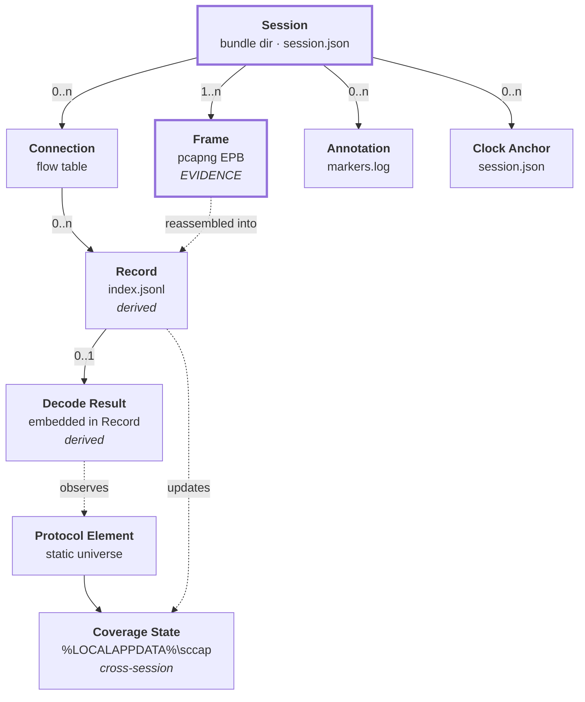

# Phase 1 Data Model: Comprehensive Protocol Capture Proxy

**Feature**: `001-capture-proxy` | **Date**: 2026-08-13 | **Spec**: [spec.md](./spec.md)

Entities are drawn from the spec's Key Entities section and made concrete against the decisions
in [research.md](./research.md). The load-bearing distinction throughout: **Frame and Session are
evidence; everything else is derived and regenerable.**



---

## Session

One continuous capture run. The unit of verification and sharing. Materialised as a bundle
directory; described by `session.json`.

| Field | Type | Notes |
|---|---|---|
| `schema_version` | string | Bundle schema, semver. Readers refuse unknown MAJOR with an explicit diagnostic (FR-027) |
| `bundle_id` | string | `SC_<UTC_START>__<SCENARIO_ID>__<VOLUNTEER_ID>__<REGION>__<SEQ>` (R12) — equals the directory name |
| `software` | object | `{name: "sccap", version, git_commit, protocol_tables_version}` — `protocol_tables_version` pins the embedded element universe, so a coverage claim can be traced to the table revision that produced it |
| `client` | object | Game build, platform, runtime, launcher, locale (FR-025) |
| `host` | object | Interfaces, off-box tap flag, offloads, capture tool, filter (empty by default), snaplen, packets captured, packets dropped |
| `utc_start` / `utc_end` | timestamp | RFC 3339, UTC, ms precision. `utc_end` absent ⇒ interrupted session |
| `clock` | object | NTP source, method, and the `anchors` array (see Clock Anchor) |
| `mode` | enum | `passive` \| `relay` — passive is the default (Principle IV) |
| `rewrites` | array | Enumerated active rewrites; empty in passive mode (FR-010) |
| `services_observed` | array | Logical services seen this session |
| `sensitive` | bool | Always `true` (FR-031) |
| `sensitivity_reason` | string | Stated plainly, e.g. credential material observed |
| `credential_warning` | bool | Set when auth material was observed (FR-033) |
| `termination` | enum | `clean` \| `interrupted` \| `disk_floor` \| `error` |
| `anomalies` | array | Free-form; carried forward from the manual's convention |

**Lifecycle**: `initialising → capturing → (closing → closed)`, with `capturing → interrupted` on
abrupt termination. A session in any terminal state is valid and verifiable; only `closed`
carries `utc_end` and a complete `SHA256SUMS`.

**Rules**
- Directory created with an owner-only DACL, inheritance severed, before any file is written into it (FR-031, R13).
- A session is valid without `index.jsonl`, without `markers.log`, and without `utc_end`.
- A session is **not** valid without at least one pcapng segment and a parseable `session.json`.

---

## Frame *(evidence — the only entity that cannot be regenerated)*

One captured link-layer frame, stored as a pcapng Enhanced Packet Block. Never modified, never
filtered, never truncated below the snaplen.

| Field | Source | Notes |
|---|---|---|
| interface id | pcapng IDB | One IDB per captured interface (`lo` and NIC both, in relay mode) |
| timestamp | kernel | Wall-clock, nanosecond resolution (`if_tsresol = 9`) |
| captured/original length | kernel | Equal unless snaplen truncated; snaplen defaults to full |
| packet bytes | wire | Complete link-layer frame including all transport headers and checksums (FR-004) |

**Rules**
- No decoder participates in producing a Frame (Principle II).
- Flushed and fsynced at most 1 s / 4 MB after capture (FR-006, R9).
- Snaplen defaults to unlimited; a non-default snaplen is recorded and warned about, because it
  is a capture-time truncation decision (Principle I).

---

## Connection

One observed path between the client and an upstream service. Derived from the flow table; a
connection is an *interpretation* of frames, so it lives in `session.json` and `index.jsonl`, not
in the pcapng.

| Field | Type | Notes |
|---|---|---|
| `conn_id` | string | Stable within a session; referenced by every Record |
| `transport` | enum | `tcp` \| `udp` |
| `endpoints` | object | `{client_ip, client_port, server_ip, server_port}` as seen on the wire |
| `service` | enum | `loadbalancer` \| `shard` \| `chat` \| `web` \| `dedicated` \| `unknown` |
| `service_evidence` | enum | `port` \| `handoff` \| `heuristic` — how `service` was decided |
| `rewritten` | bool | True only in relay mode, for connections whose address was rewritten |
| `first_seen` / `last_seen` | timestamp | Wall-clock bounds |
| `reassembly_state` | enum | `ok` \| `desynced` — desync point recorded, capture unaffected |

**Service classification**
- Ports 3801 / 3802 / 3815 → `loadbalancer` / `shard` / `chat` (evidence: `port`).
- `SCMD_ASSIGNED_SHARD` (type 0) supplies the real shard and chat addresses.
- `SCMD_CONNECT_DEDICATED_SERVER` (type 11) supplies `addr`, `port`, `session_id` (u64),
  `zone_id` → the subsequent UDP flow is classified `dedicated` (evidence: `handoff`).
- Anything else touching a game-adjacent endpoint → `unknown`, journaled, never dropped (FR-005).

**Rules**
- A client reconnect creates a new Connection within the **same** Session (spec edge case).
- Classification never gates capture: an unclassifiable flow is captured identically.

---

## Record *(derived)*

One protocol-level unit — a datagram, or one framed message on a reassembled stream. One JSON
object per line in `index.jsonl`. Fully regenerable via `sccap index --rebuild`.

| Field | Type | Notes |
|---|---|---|
| `seq` | integer | Monotonic within session |
| `conn_id` | string | → Connection |
| `dir` | enum | `c2s` \| `s2c` (FR-007) |
| `t_wall` | timestamp | UTC nanoseconds (FR-003) |
| `t_mono` | integer | Nanoseconds since session start (FR-003) |
| `frames` | array[int] | pcapng frame numbers this record spans — the link back to evidence |
| `byte_len` | integer | Length of the protocol unit |
| `decode` | object\|null | → Decode Result; `null` means not yet attempted |

**Rules**
- A Record always cites its frames. A Record that cannot cite frames is a bug, not a record.
- Records are appended during capture but the journal never waits on them (no backpressure).
- A truncated final line after abrupt termination is expected and detected on parse; it does not
  invalidate the session (R3, R9).

---

## Decode Result *(derived)*

The interpretation of a Record. Never a substitute for the Record's bytes.

| Field | Type | Notes |
|---|---|---|
| `status` | enum | `decoded` \| `undecoded` \| `unknown_element` \| `failed` |
| `message_type` | string | e.g. `CSCMD_ASYNC_REQ` (type 13) |
| `element` | string\|null | Sub-type: `AC_*` opcode or `SN_*` notification (FR-015) |
| `fields` | object\|null | Decoded fields, present only when `status = decoded` |
| `reason` | string\|null | Why decoding stopped, for `undecoded` / `failed` |
| `novel` | bool | Element not in the known universe — flagged and surfaced (FR-023) |

**Status semantics** (these map one-to-one onto FR-022's three-way distinction plus failure):
- `decoded` — type and body both understood.
- `undecoded` — element recognised, body layout not known. Bytes are safe; meaning is not known.
- `unknown_element` — an opcode or type absent from the known universe. Recorded and flagged.
- `failed` — the decoder errored or panicked on this record. Contained; capture unaffected.

**Rules**
- A panic during decode is recovered per-record, recorded as `failed`, and never propagates
  (Principle II, FR-016).
- Partial interpretations are never presented as complete: anything short of a full decode is
  `undecoded` with raw bytes reachable via `frames` (FR-017).

---

## Clock Anchor

A paired reading of both clocks, written to `session.json`. Makes monotonic time recoverable for
any frame and makes a wall-clock step visible instead of corrupting.

| Field | Type | Notes |
|---|---|---|
| `t_wall` | timestamp | `CLOCK_REALTIME`, UTC nanoseconds |
| `t_mono` | integer | `CLOCK_MONOTONIC`, nanoseconds since session start |
| `kind` | enum | `start` \| `periodic` \| `step_detected` \| `end` |

**Rules**
- Written at start, every 30 s, at end, and whenever realtime advances by more than 1 s relative
  to monotonic (a clock step) — the step is recorded, ordering is unaffected (R4).

---

## Protocol Element

A named, addressable unit of the protocol whose observation is tracked. Static universe,
bootstrapped from the tree.

| Field | Type | Notes |
|---|---|---|
| `kind` | enum | `message_type` \| `async_request` \| `notification` |
| `id` | integer | Numeric opcode / type index |
| `name` | string | e.g. `AC_LOAD_INITIAL_PLAYER_DATA` |
| `source` | string | Where the name came from, for provenance |

**Universe** (counted from the working tree, not aspirational):

| Kind | Count | Source (frozen snapshot, `go:embed`ed) |
|---|---:|---|
| `message_type` | 39 | `docs/protocol/message-types.json` |
| `async_request` | 249 | `docs/protocol/async-requests.json` |
| `notification` | 116 | `docs/protocol/notifications.json` |

Provenance and licence: `docs/protocol/PROVENANCE.md`. These are **names, not body layouts** —
the gap between the two is what the coverage feature measures.

---

## Coverage State

Persistent, cross-session, machine-wide. The project's progress metric against the deadline
(Principle III). Stored at `%LOCALAPPDATA%\sccap\coverage.json`, replaced
atomically.

| Field | Type | Notes |
|---|---|---|
| `schema_version` | string | Versioned like the bundle schema |
| `elements` | map | `element_key → {state, first_seen_session, first_seen_utc, observations}` |
| `novel` | array | Elements observed but absent from the known universe (FR-023) |
| `updated_utc` | timestamp | Last aggregation |

**Element state** — a strict, one-directional lattice:

```
never_observed  →  observed_undecoded  →  decoded
```

**Rules**
- State never regresses. A later session that fails to decode an already-decoded element does not
  downgrade it (FR-020, FR-024).
- Aggregates across all sessions on the machine and survives restarts (FR-024).
- Updated from Records after a session closes, and incrementally during capture for live novelty
  reporting; a lost incremental update is recovered by re-running `sccap coverage --ingest`.
- Every session also writes a `coverage-delta.json` into its own bundle, so a bundle carries what
  it contributed and coverage can be rebuilt from bundles alone.

---

## Annotation

A labelled point or span on the session timeline, from a contributor or derived from decoded
traffic.

| Field | Type | Notes |
|---|---|---|
| `seq` | integer | Marker sequence, matching the SCMARK beacon numbering |
| `t_wall` / `t_mono` | timestamp / integer | Both clocks |
| `kind` | enum | `heartbeat` \| `event` \| `derived` \| `anomaly` |
| `label` | string | Free text (contributor) or generated summary (derived) |
| `source` | enum | `contributor` \| `system` |

**Rules**
- Contributor marks are written to `markers.log` in the existing beacon line format **and**
  broadcast as a UDP datagram so they land inline in the pcapng — preserving the three-way
  video/packet/log binding the manual's §2.5 depends on (R14, FR-018).
- Derived annotations come from decoded traffic (e.g. an economy transaction, a match handoff)
  and carry `source: system` so they are never confused with contributor testimony (FR-019).

---

## Validation rules summary

| Rule | Enforced by | Requirement |
|---|---|---|
| Every byte on an interposed connection is in the journal | Capture path; the driver's drop counter must be 0 | FR-001, SC-002 |
| No decoder in the write path | Import-cycle test: `journal` must not import `decode` | FR-002, Principle II |
| Both timestamps on every record | Index writer; clock anchors for interpolation | FR-003 |
| Unknown traffic journaled and marked | `service: unknown`, `status: unknown_element` | FR-005, FR-023 |
| Session valid after abrupt kill | Structural pcapng walk + tolerant JSONL parse | FR-006, SC-008 |
| Schema version refusal is explicit | Reader checks MAJOR before anything else | FR-027 |
| Coverage never regresses | State lattice is one-directional | FR-020, FR-024 |
| Sensitive by default | `session.json.sensitive` hard-coded true; owner-only DACL | FR-031 |
| No egress | No network-write code path exists outside the relay's upstream sockets | FR-032, SC-009 |
